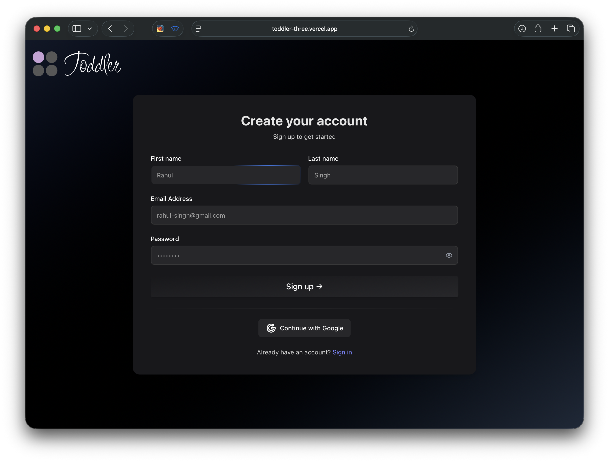
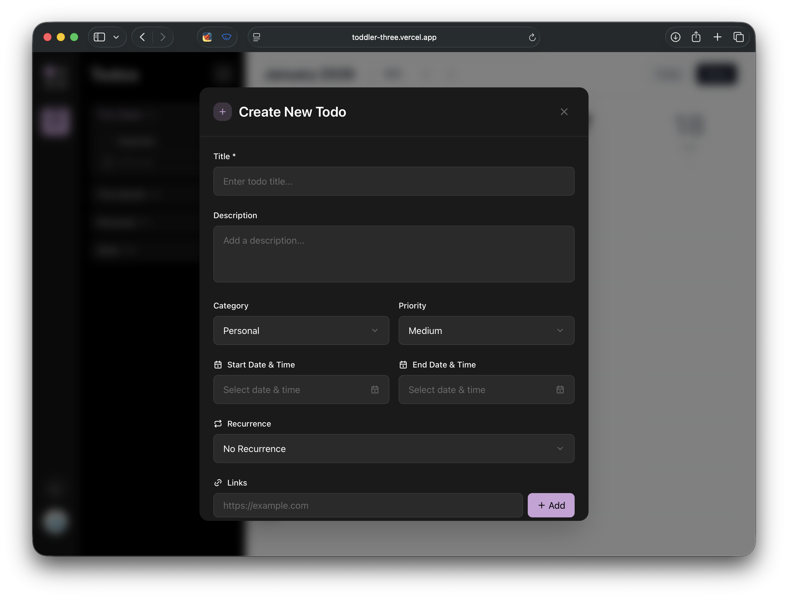
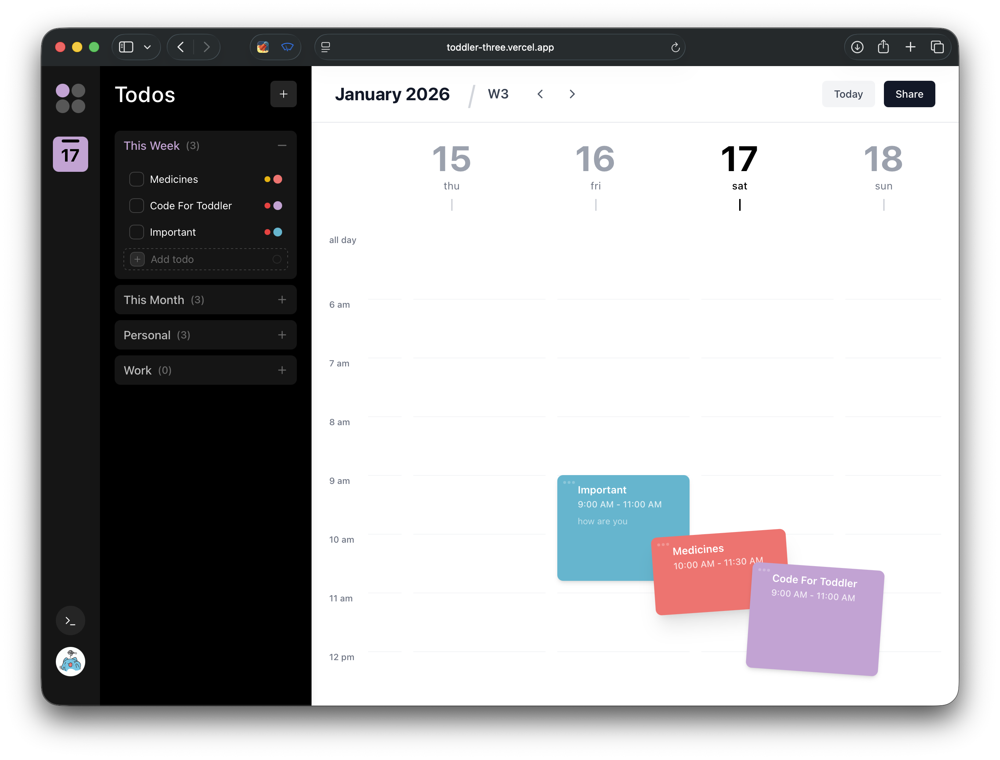
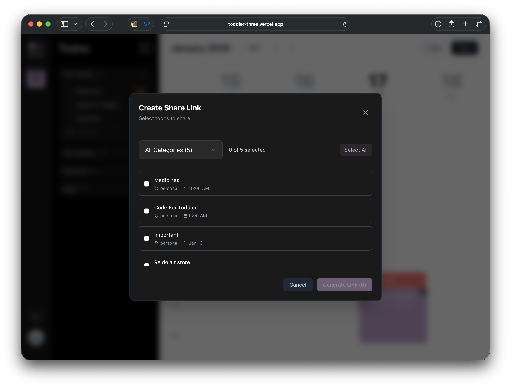

# Toddler – Collaborative Todo App

**Toddler** is a modern, collaborative Todo application designed for productivity, clarity, and teamwork.  
It combines powerful task management features with a visually engaging UI and real-time collaboration.

🔗 **Live App:** https://toddler-three.vercel.app

---
## 📸 Screenshots

### 🔐 Login Page

---

### ➕ Create Todo

---

### 👀 Todo View

---

### 🤝 Share / Create Todo Link

## Features

### Authentication
- Firebase Authentication
- Sign in with **Google**
- Sign up / login using **Username & Password**

---

### Advanced Todo Management
- Create Todos with:
  - **Title**
  - **Description**
  - **Category** (Personal, Work, Custom categories)
  - **Priority** (Low, Medium, High)
  - **Start Date & Time**
  - **End Date & Time**
  - **Recurrence**
    - Daily
    - Weekly
    - Monthly
    - Yearly
  - **External Links**
- Edit Todos anytime
- Mark Todos as completed

---

### Rich Visual Customization
- Card-style Todos for better engagement
- Custom Todo colors:
  - Predefined color palette
  - Color wheel picker
  - Hex color input
- Dynamic Todo detail view for better visualization

---

### Smart Sidebar Navigation
- Organized Todo listing:
  - Today
  - This Month
  - Categories
- Expand / collapse sections
- Sidebar toggle button for distraction-free focus
- Displays **today’s day and date** under the app logo

---

### Drag & Drop
- Drag and drop Todos to **delete**
- Works from:
  - Todo cards
  - Sidebar list

---

### Collaboration & Sharing (Advanced Feature)
- Share selected Todos via **secure share link**
- Share links:
  - Are **time-limited**
  - Can be opened by other users
- Shared users can:
  - View shared Todos
  - Mark assigned Todos as completed
- Todo owner gets **in-app notifications** when:
  - A shared Todo is completed
- Todo cards display:
  - **Owner of the Todo**
  - **Users with whom the Todo is shared**

>  **Email-based sharing is coming soon**

---

### Productivity Helpers
- **Today Button** – instantly jump back to today’s date
- Recurring Todos for long-term planning

---

## Tech Stack

- **Frontend:**  
  - Next.js  
  - TypeScript  
  - CSS
  - Other

- **Backend & Services:**  
  - Firebase Authentication  
  - Firebase Database  

- **Hosting:**  
  - Vercel

---

## Future Enhancements
- Email-based Todo sharing
- Push notifications
- Analytics for productivity insights
- Custom designs for user interactiveness

## Author

**Rahul Singh Jadoun**
If you like this project, ⭐️ the repo!
Feel free to connect, collaborate, or contribute to this project!
  
